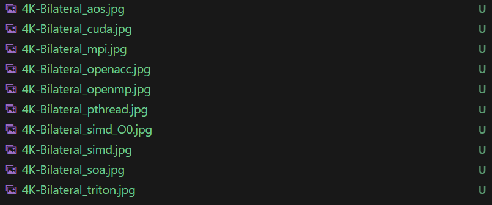
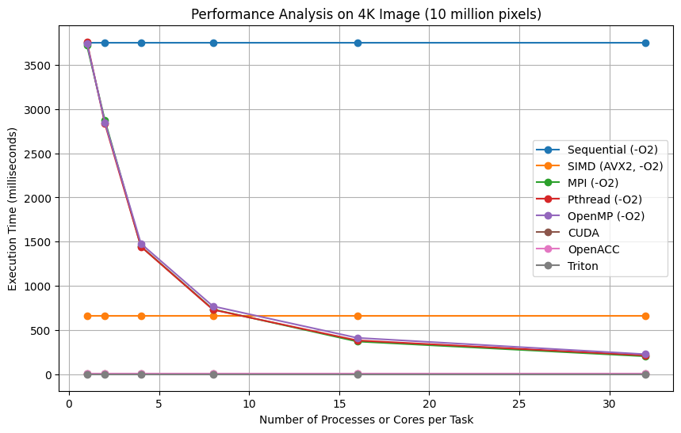
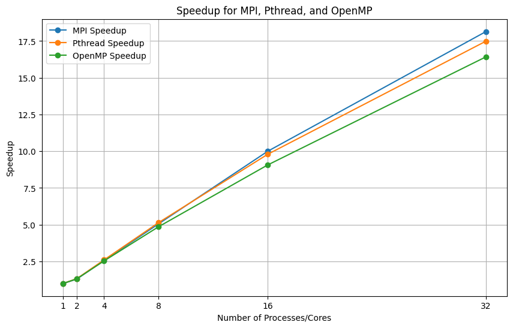
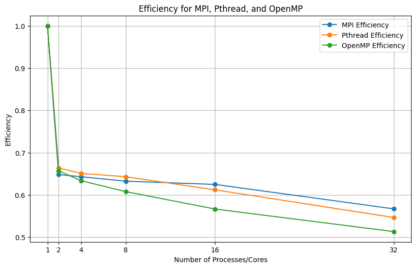

# Compile & Execute
Make sure under `project1` directory.
```
mkdir build && cd build
cmake ..
make
```
Then run the code under `project1` directory.
```
cd ..
sbatch src/scripts/sbatch_PartA.sh
sbatch src/scripts/sbatch_PartB.sh
sbatch src/scripts/sbatch_PartC.sh
```
Independently to run PartA/PartB/PartC and the you can get the performanc of each part. 

Run the code under `project1` directory.
```
sbatch src/scripts/sbatch_PartC_pics.sh
```
Then you can see the output pictures under the direcotry `project1/images`, and they are. 

# Explanation and Speedup methods
## 1.Pthread
The Pthreads model in this program allows for parallel computation by dividing the image into smaller tasks that can be processed concurrently by multiple threads. The use of atomic operations for task allocation ensures that the threads do not interfere with each other, and the program efficiently utilizes the available CPU cores to speed up the image filtering process.
## 2.OpenMP
OpenMP is similar to the pthread model. It allows for parallel computation by dividing the image into smaller tasks that can be processed concurrently by multiple threads but automatically achieved by the openmp operation. `collapse(3)` are use to collapse loops which can make it run multi-thread more balancing.

Both OpenMP and Pthread uses TLP(Thread Level Parallelism) to run multiple threads within a program concurrently.
## 3.MPI
MPI distributes the workload across multiple processes, allowing each process to work on a portion of the image simultaneously and use non-blocking communication to overlap computation and communication, reducing idle time.Moreover, MPI manages resources by balancing the load and utilizing multiple cpus, thereby maximizing the use of available computational power. To have better performance, openMP are used to used to parallel compute filters.

Different from OpenMP and Pthread, MPI mostly uses PLP(Process Level Parallelism) to run multiple processes in parallel, with each process potentially running on a different CPU core or node.

## 4.SIMD 
SIMD, specifically AVX2,
vectorizes operations to process multiple data points simultaneously and reduces memory access by fetching and storing larger chunks of data. Moreover, SIMD reduces loop overhead by decreasing the number of iterations. Moreover, I fastup the vectorization   `exp` operation, some mathematical methods like *Padé approximant* are used to optimize the porgram.

SIMD performs the same operation on multiple pieces of data, which means DLP(Data Level Parallelism). SIMD does not rely on the multi-cores, which means it can fastup the program with one CPU.

## 5. OpenACC
OpenACC manages data transfer between the host and the device, ensuring that the necessary data is available on the GPU, and creates parallel regions on the GPU to distribute the workload across multiple threads. It also executes loops in parallel, allowing the GPU to process multiple pixels simultaneously. To fastup the program, memory access are optimized to take advantage of the GPU's coalesced memory access patterns. Moreover, GPU can perform floating-point operations and other mathematical functions more efficiently than the CPU, such as the `exp` operation. By offloading the computationally intensive parts of the image filtering process to the GPU, OpenACC significantly reduces the overall execution time, making the program more efficient and faster.

## 6. CUDA
By organizing the image processing task into a grid of blocks and threads, CUDA allows the bilateral filtering program to take full advantage of the GPU's parallel processing capabilities. Each thread efficiently processes a pixel and its neighborhood, and the use of asynchronous memory transfers and concurrent kernel executions further optimizes performance. 

## 7. Triton
Triton enables efficient parallelism in the bilateral filter implementation by compiling the kernel with `@triton.jit`, configuring the grid and block sizes to process each pixel independently, using thread indexing and masking to handle boundary conditions, and optimizing memory access and vectorized operations to ensure safe and efficient computation. This results in high-performance image processing on the GPU.

All of OpenACC, CUDA, Triton uses TLP and DLP to achieve parallelism. Especially, with the thousands of threads, GPU can achieve better performance than cpu with large scale tasks.

# Performance


| Number of Processes / Cores | Sequential (AOS, -O0) | Sequential (SOA, -O0) | Sequential (-O2) | SIMD (AVX2, -O0) |  SIMD (AVX2, -O2) | MPI (-O2)  | Pthread (-O2) | OpenMP (-O2) | CUDA |OpenACC | Triton |
|-----------------------------|-----------------------|-----------------------|------------------|------------------|-------------------|------------|---------------|--------------|------|---------|-------|
| 1                           | 10326                 | 9773                  | 3745             | 3366*             | 659*              | 3719       | 3760          | 3744         | 6.5*  | 5*      |2.06   |
| 2                           | N/A                   | N/A                   | N/A              | N/A              | N/A               | 2869       | 2833          | 2849         | N/A  | N/A     | N/A       |
| 4                           | N/A                   | N/A                   | N/A              | N/A              | N/A               | 1446       | 1444          | 1477         | N/A  | N/A     |  N/A      |
| 8                           | N/A                   | N/A                   | N/A              | N/A              | N/A               | 735        | 731           | 770          | N/A  | N/A     |  N/A      |
| 16                          | N/A                   | N/A                   | N/A              | N/A              | N/A               | 372        | 384           | 413          | N/A  | N/A     |  N/A      |
| 32                          | N/A                   | N/A                   | N/A              | N/A              | N/A               | 205        | 215           | 228          | N/A  | N/A     |  N/A      |


`*` represents better performance.  
In SIMD, CUDA, and OpenACC, I have better performance.   
For SIMD, I fastup the vectorization `exp` operation, some mathematical methods like *Padé approximant* are used to optimize the porgram. This method is much faster to use the official `exp`.  
For CUDA, by calculating spatial weights inside the loop based on the specific distances from the center, the optimized function avoids precomputing and storing unnecessary values, leading to more efficient use of computational resources. The optimized function combines the spatial and intensity weight calculations in a single step for each neighbor, reducing the number of operations.The loop structure in the optimized function ensures that memory accesses are more predictable and potentially better optimized by the GPU, which can improve performance.  
For OpenACC, each input_image channels and output_image channels is transferred , computed ,and updated independently. When each channel is processed independently, the memory access patterns for each channel can be optimized separately. This can lead to better coalesced memory access, which is crucial for efficient GPU performance.


### Speedup (S) Table

| Processes/Cores | Speedup (MPI) | Speedup (Pthread) | Speedup (OpenMP) |
|-----------------|---------------|-------------------|------------------|
| 1               | 1.00          | 1.00              | 1.00             |
| 2               | 1.30          | 1.33              | 1.31             |
| 4               | 2.57          | 2.60              | 2.53             |
| 8               | 5.06          | 5.14              | 4.86             |
| 16              | 10.00         | 9.79              | 9.07             |
| 32              | 18.14         | 17.49             | 16.41            |

### Efficiency (E) Table

| Processes/Cores | Efficiency (MPI) | Efficiency (Pthread) | Efficiency (OpenMP) |
|-----------------|------------------|----------------------|---------------------|
| 1               | 1.00             | 1.00                 | 1.00                |
| 2               | 0.65             | 0.67                 | 0.66                |
| 4               | 0.64             | 0.65                 | 0.63                |
| 8               | 0.63             | 0.64                 | 0.61                |
| 16              | 0.63             | 0.61                 | 0.57                |
| 32              | 0.57             | 0.55                 | 0.51                |


### Speedup Analysis:
The diminishing speedup across all methods, is due to increased communication and synchronization overhead, which limits the benefits of additional cores.

### Efficiency Analysis:
Efficiency declines with more cores because the parallelization overhead (such as inter-process communication and thread management) grows, consuming more resources and reducing the effectiveness of parallel scaling.

For each Speed and Efficiency, MPI performs best. It performs the best because it is designed for distributed memory systems, allowing processes to run independently with minimal shared memory contention. This reduces the overhead from synchronization compared to thread-based models like Pthread and OpenMP.

# Discovery
1. GPU parralelism has better performance than CPU, which because GPU has much more threads to compute floating-point mathematical tasks.
2. MPI performs better than pthread and openmp in part C ,but in part A&B, pthread performs best. The reason is for part C, the computation of floating point is much heavier than part A&B. The communication cost is larger for MPI, compared with computation cost for part A&B. But for pthread, the communication is samller and easier, and it can perform well for part A&B. 