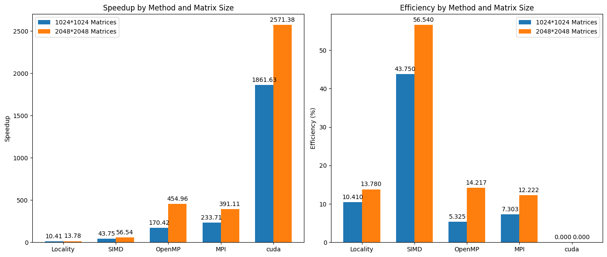

# Compile & Excecute
Make sure under  `project2` directory.
```
mkdir build && cd build
cmake ..
make
```
Then run the code under `project1` directory.
```
sabtch src/sbach.sh
```
You can get the performance of matrix5 * matrix6 with each program. 
To test whether the program run correctly, you can test with each program by using the following scripts.
```
cd /path/to/project2/build
# Naive
srun -n 1 --cpus-per-task 1 ./src/naive /path/to/matrixA /path/to/matrixB /path/to/multiply_result
# Memory Locality
srun -n 1 --cpus-per-task 1 ./src/locality /path/to/matrixA /path/to/matrixB /path/to/multiply_result
# SIMD
srun -n 1 --cpus-per-task 1 ./src/simd /path/to/matrixA /path/to/matrixB /path/to/multiply_result
# OpenMP
srun -n 1 --cpus-per-task $num_cores ./src/openmp /path/to/matrixA /path/to/matrixB /path/to/multiply_result
# MPI
srun -n $process_num --cpus-per-task $thread_num_per_process --mpi=pmi2 ./src/mpi $thread_num_per_process /path/to/matrixA /path/to/matrixB /path/to/multiply_result
```
Moreover, I finished the cuda program to deal with matrix multiplication. To compile and excecute the program, you need to make sure under the `project2/src/gpu` directory. I modified the `CMkakeLists.txt` in the directory to:
```
# Minimum CMake version
cmake_minimum_required(VERSION 3.10)
# Required packages and flags
## CUDA
set(CMAKE_CUDA_COMPILER "/opt/nvidia/hpc_sdk/Linux_x86_64/21.7/cuda/11.4/bin/nvcc")
set(CUDA_TOOLKIT_ROOT_DIR "/opt/nvidia/hpc_sdk/Linux_x86_64/21.7/cuda/11.4")
enable_language(CUDA)  # 启用CUDA支持
find_package(CUDA REQUIRED)
if (CUDA_FOUND)
    message("CUDA FOUND, Version: " ${CUDA_VERSION_STRING})
endif ()

SET(CMAKE_CXX_COMPILER pgc++)

## CUDA
list(APPEND CUDA_NVCC_FLAGS "-fmad=false")

cuda_add_executable(cuda
        cuda.cu
        ../matrix.cpp ../matrix.hpp)
target_link_libraries(cuda cudart )
set_target_properties(cuda PROPERTIES LINK_FLAGS "-Wl,-rpath,/opt/nvidia/hpc_sdk/Linux_x86_64/21.7/cuda/11.4/lib64")
```
Then compile the `cuda.cu`
```
mkdir build && cd build
cmake ..
make
```
Now you can run it 
```
srun -n 1 --gpus 1 ./cuda /path/to/matrixA /path/to/matrixB /path/to/multiply_result
```
# Explanation and Speedup methods
## 1.Locality
In this program, I firstly try to exchange j and k to lower the cache miss. Then I found that using the ikj loops, the m1 matrix can be recorded by a `temp` variable to reduce the redundant reads of m1, thereby optimizing performance.  
Moreover, I tried the  tiling performance, this approach can help the program have better cache utilization. This reduces the number of cache misses, as the same data is reused across several operations within the tile, rather than being fetched from slower main memory repeatedly.  
After these speed up methods, I finished the program with high performance.
## 2.SIMD
In this program, I uses the locality and tiling to speedup too. To have better performance, I uses simd instructions in the matrix multiplication. 8 values will be read and write with _m256i variables. The simd instructions can deal with 8 values at a time, so the performance will become much better.
Because the matrix may not be the  multiple of 8. the matrix's cols will be aligned to multiple of 8. Moreover, `_mm_malloc(M * K_align * sizeof(int), 32)`, `_mm256_load_si256`, `_mm256_store_si256` will be used to make sure that all the simd instruction is aligned to 32 bytes and it can help the performance better.
## 3.OpenMP
In this program, I uses the locality and simd to speedup. To have better performance, I uses openmp to speed up. Similar to the simd program, the most difference is that I give up the tiling but add `#pragma omp parallel for schedule(static)` before the loops.
## 4.mpi
In this program, I uses the locality, simd and openmp to speedup. To have better performance, I uses MPI to speed up. 
The master process (rank 0) collects all the partial results from other processes. It starts by storing its own computed rows into the final result matrix.Then, I uses MPI_Recv to receive the partial results from other processes. All non-master processes send their partial results back to the master process using MPI_Send.  
## 5.CUDA
CUDA speeds up the program by offloading the matrix multiplication computation to the GPU, which is designed to handle a large number of parallel operations simultaneously. By executing the `matrixMulKernel` across many threads in parallel, CUDA can significantly reduce the time required for the calculation compared to a sequential CPU implementation, especially for large matrices.
# Performance analysis
Let's define the formulas:

Speedup = T_naive / T_optimized
Efficiency = Speedup / Number of processors

For 1024*1024 matrices:

| Methods | Time (ms) | Speedup | Efficiency |
| --- | --- | --- | --- |
| Naive | 8180 | 1.00 | - |
| Memory Locality | 786 | 10.41 | 10.41 |
| SIMD + Memory Locality | 187 | 43.75 | 43.75 |
| OpenMP + SIMD + Memory Locality (32 threads) | 48 | 170.42 | 5.325 |
| MPI + OpenMP + SIMD + Memory Locality (total 32 threads) | 35 | 233.71 | 7.303 |
| CUDA | 4.394 | 1861.63 | - |


For 2048*2048 matrices:

| Methods | Time (ms) | Speedup | Efficiency |
| --- | --- | --- | --- |
| Naive | 89173 | 1.00 | - |
| Memory Locality | 6472 | 13.78 | 13.78 |
| SIMD + Memory Locality | 1576 | 56.54 | 56.54 |
| OpenMP + SIMD + Memory Locality (32 threads) | 196 | 454.96 | 14.217 |
| MPI + OpenMP + SIMD + Memory Locality (total 32 threads) | 228 | 391.11 | 12.222 |
| CUDA | 34.679 | 2,571.38 | - |

## Analysis
By using locality and simd, the speedup and efficiency both increases significantly. OpenMP and MPI have similar performance, which both achieve high speedup but less efficiency compared wtih SIMD+Locality.  
Moreover, it can be shown that larger matrices generally benefit more from optimizations, as evidenced by higher speedups and efficiencies.  
CUDA has too many threads to calculate matrix multiplication. As a result, the speedup can be quite large.
# Perf Analysis
1. Naive Matrix Multiplication  
Execution Time: 8215 milliseconds  
CPU Cycles: 24,154,349,333  
Cache Misses: 511,252  
Page Faults: 10,045  


Analysis:   
The naive implementation is significantly slow, with a high number of CPU cycles and a large number of cache misses. This indicates that the memory access pattern is not efficient, leading to frequent cache misses and a high execution time.
The relatively high number of page faults (10,045) suggests that there are many instances where the required data is not in the physical memory, causing the system to fetch it from disk, which is a very slow operation.


2. Memory Locality Matrix Multiplication  
Execution Time: 788 milliseconds  
CPU Cycles: 2,802,046,571  
Cache Misses: 546,471  
Page Faults: 6,539  


Analysis:   
The memory locality optimization reduces the execution time by over 10 times compared to the naive approach. And the CPU cycles falls from 24,154,349,333  to 2,802,046,571 which is about 10 times speedup. The number of cache misses is still significant (546,471), but it is lower than the naive version, indicating an improvement in memory access efficiency. All These are due to the more efficient memory access pattern -- locality and tiling, which reduces the number of cache misses and CPU cycles.  
The number of page faults is also reduced, suggesting better use of the available physical memory. 

3. SIMD + Memory Locality Matrix Multiplication  
Execution Time: 188 milliseconds 
CPU Cycles: 996,331,133  
Cache Misses: 491,874  
Page Faults: 6,539  

Analysis:  
The addition of SIMD instructions further reduces the execution time by more than 4 times compared to the memory locality version. SIMD allows for parallel processing of multiple data points, which can significantly speed up the computation.
The number of CPU cycles is greatly reduced, reflecting the efficiency of SIMD operations.
The number of cache misses is slightly lower, indicating that the SIMD instructions, combined with memory locality, are more effective at utilizing the cache.
The number of page faults remains the same, suggesting that the memory layout and usage are similar to the memory locality version.

4. OpenMP + SIMD + Memory Locality Matrix Multiplication  
Number of Cores: 1    
Execution Time: 230 milliseconds   
CPU Cycles: 1,104,634,879  
Cache Misses: 503,043  
Page Faults: 6,590  
Number of Cores: 2  
Execution Time: 199 milliseconds  
CPU Cycles: 1,503,042,947  
Cache Misses: 506,585  
Page Faults: 6,595  
Number of Cores: 4  
Execution Time: 113 milliseconds  
CPU Cycles: 1,504,403,485  
Cache Misses: 695,043  
Page Faults: 6,598  
Number of Cores: 8  
Execution Time: 74 milliseconds  
CPU Cycles: 1,636,849,330    
Cache Misses: 574,654  
Page Faults: 6,608    
Number of Cores: 16  
Execution Time: 64 milliseconds   
CPU Cycles: 1,918,864,093    
Cache Misses: 587,891  
Page Faults: 6,625  
Number of Cores: 32   
Execution Time: 51 milliseconds   
CPU Cycles: 2,546,744,486  
Cache Misses: 531,721  
Page Faults: 6,661  

Analysis:   
The OpenMP + SIMD + Memory Locality version shows a significant reduction in execution time as the number of cores increases, demonstrating the effectiveness of parallelization.  
The number of CPU cycles increases with the number of cores, which is expected since more cores are performing work simultaneously.  
The number of cache misses varies, but generally, it does not increase linearly with the number of cores, indicating that the memory access pattern is well-optimized.  
The number of page faults remains relatively stable, suggesting that the memory footprint is managed efficiently across different numbers of cores. More cores, More page faults slightly. It may because that some more physical memory are used to deal with the multithread operations, and that the locality may be influenced by the multithread.

5. MPI + OpenMP + SIMD + Memory Locality

### Performance Data Summary(For multi processes, I show just 2 of them for each one)

| Processes | Threads | Execution Time (ms) | CPU Cycles (u) | Cache Misses (u) | Page Faults (u) |
|-----------|---------|---------------------|----------------|------------------|-----------------|
| 1         | 32      | 50                  | 2,518,364,724  | 629,440          | 9,127           |
| 2         | 16      | 34                  | 1,793,037,443  | 540,841          | 7,615           |
| 2         | 16      | 34                  | 1,185,631,783  | 424,909          | 8,666           |
| 4         | 8       | 35                  | 1,165,707,818  | 538,700          | 6,829           |
| 4         | 8       | 35                  | 1,228,221,977  | 315,295          | 6,829           |
| 8         | 4       | 31                  | 1,076,526,800  | 542,789          | 6,443           |
| 16        | 2       | 44                  | 948,997,943    | 799,177          | 6,261           |
| 16        | 2       | 44                  | 700,048,401    | 522,772          | 9,386           |
| 32        | 1       | 70                  | 1,544,119,722  | 1,632,044        | 6,175           |
| 32        | 1       | 70                  | 1,550,339,476  | 2,082,803        | 6,174           |

### Analysis and Discussion
It shows that as the number of processes increases and the number of threads decreases, the execution time, cpu cycles and cache misses become lower. And there is a sweet spot at 8 processes and 4 threads where the execution time, cpu cycles and cache misses minimized. It perhaps because that memory locality is better maintained with more threads per process, leading to fewer cache misses. At 16 processes and 2 threads and 32 processes and 1 thread, the execution time, cpu cycles and cache misses become worse. The performance degradation at 16 processes and 2 threads, and 32 processes and 1 thread, is likely due to a combination of increased communication overhead, memory bandwidth contention. As the number of processes increases, the communication overhead between processes also increases. MPI requires more coordination and data exchange among processes, which can become a bottleneck. This is especially true when the number of processes is high, as seen in the 16 and 32 process configurations. And more processes mean more frequent synchronization points, which can add latency and reduce overall efficiency.   

We can also find that page faults are relatively stable across different configurations. It shows that similar physical memory are used to deal with the same problem, but with the same configuration, the page faults may be different, It may because the workload is not evenly distributed among the processes, the memory used would be different. And the main process need to gather all the data from other processes, it would increase the main processes page faults.
 